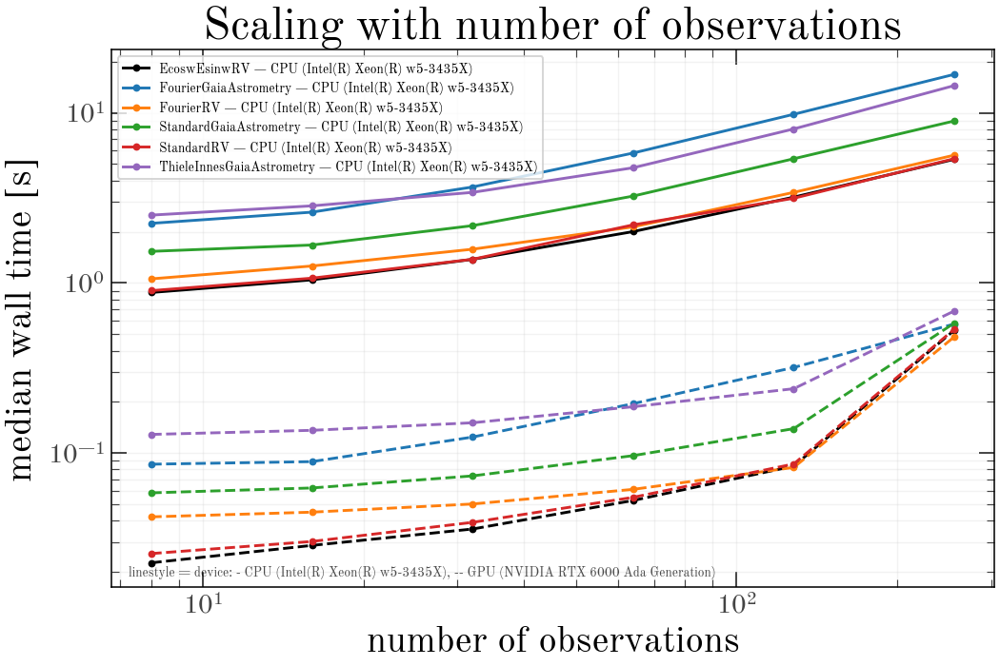
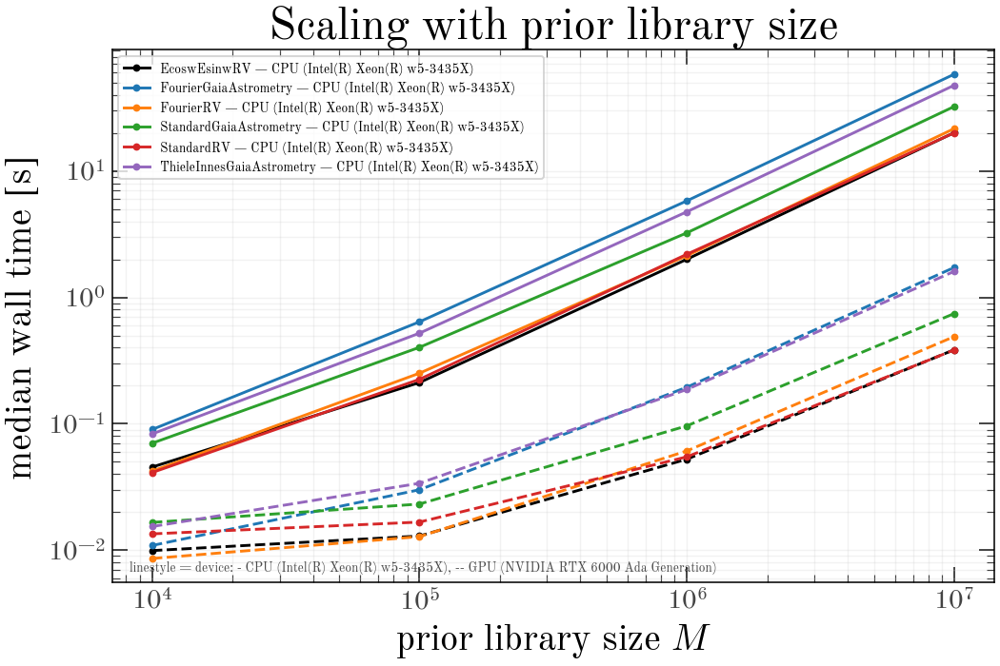

# Benchmarks

Wall-clock scaling of harv's `RejectionSampler`
across model parameterizations, dataset sizes, prior library sizes, and
`batch_size`. Every number here is measured, not modelled.

:::{note}
This page is generated from committed benchmark results and is **not**
rebuilt when the docs build — ReadTheDocs has no GPU. To regenerate it, see
{doc}`running-benchmarks`.
:::

## Run metadata

| device | date | platform | jax | harv | float64 | top_k |
|---|---|---|---|---|---|---|
| CPU (Intel(R) Xeon(R) w5-3435X) | 2026-08-31 | Linux / py3.12.9 | 0.8.1 | 0.0.2.dev76+g96c452d50.d20260831 | yes | 256 |
| GPU (NVIDIA RTX 6000 Ada Generation) | 2026-08-31 | Linux / py3.12.9 | 0.8.1 | 0.0.2.dev76+g96c452d50.d20260831 | yes | 256 |

All cells use `top_k` selection, which gives a static output shape so that
timings are not contaminated by recompilation as the accepted-sample count
changes (see the Top-K selection section of the design spec).

## What the numbers say

Computed from the results in this page, on the hardware above. The
interpretation is fixed; the figures are not, so regenerating on your own
machine ({doc}`running-benchmarks`) updates them rather than contradicting
them.

### The GPU advantage grows with library size

At `M=1e4` the GPU is only 3.1-8.3x faster; at `M=1e7` it is 29.6-52.1x. The reason is in the
slopes: cost is near-linear in `M` on CPU and clearly sublinear on
GPU, because a small library cannot fill the device. Below roughly
`M=1e5` a GPU call is dominated by fixed cost, not by work — the smallest warm call measured here is 9 ms on GPU against 41 ms on CPU.

**Consequence for population runs.** That floor is paid once per
source. Millions of sources at small `M` spend most of their time in
per-call overhead, so a GPU pays off through *bigger libraries*, not
through more calls. See {doc}`at-scale`.

### Throughput, in millions of prior samples per second

Sustained rate at `M=1e7`, `n_obs=64`, in-memory library.
This is the number to plan a run from.

| parameterization | CPU (Intel(R) Xeon(R) w5-3435X) | GPU (NVIDIA RTX 6000 Ada Generation) |
|---|---|---|
| StandardRV | 0.50 | 26.0 |
| EcoswEsinwRV | 0.50 | 25.9 |
| FourierRV | 0.46 | 20.4 |
| StandardGaiaAstrometry | 0.31 | 13.4 |
| ThieleInnesGaiaAstrometry | 0.21 | 6.2 |
| FourierGaiaAstrometry | 0.17 | 5.8 |

The spread across parameterizations is real work, not noise: the
astrometric models carry more linear columns than the RV ones, and the
Thiele-Innes variant additionally evaluates a Jacobian correction per
sample.

### The speedup is free

Across all 66 cells measured on both devices, the largest relative
difference in `logZ_int_ess` is 1.4e-10. Both runs pin float64,
and the GPU is not trading accuracy for speed — it is the same
arithmetic, faster.

### `batch_size` matters more on CPU than on GPU

- **CPU (Intel(R) Xeon(R) w5-3435X)**: slowest/fastest `batch_size` at fixed `M` spans 1.55-1.84x.
- **GPU (NVIDIA RTX 6000 Ada Generation)**: slowest/fastest `batch_size` at fixed `M` spans 1.04-1.13x.

This inverts the guidance the design spec used to give. Setting
`batch_size = n_prior_samples` on GPU is not the lever it was
assumed to be; the device is already saturated at far smaller
batches.
The knob sets the working-set size of the `(batch, n_obs, n_linear)`
intermediate, which is why it moves CPU timings at all.

:::{warning}
Every CPU cell here is a **single process on an otherwise idle node**, so
these are per-core ceilings, not per-node predictions. Under many-rank
contention the optimum moves *down*, because ranks compete for memory
bandwidth — a large batch that wins alone can starve a full node. Measure
it under the contention you will actually run. See {doc}`at-scale`.
:::

### Streaming from HDF5 costs the GPU much more than the CPU

- **CPU (Intel(R) Xeon(R) w5-3435X)**: 1.05-1.22x of the in-memory time.
- **GPU (NVIDIA RTX 6000 Ada Generation)**: 1.35-1.76x of the in-memory time.

The absolute I/O cost is similar; what differs is what it is
competing with. On CPU the compute is slow enough to hide the
reads. On GPU the compute is fast enough that the reads become
the run.
Keep the library in memory whenever it fits, and reserve the HDF5 path
for libraries that genuinely cannot.

### Compilation is a per-shape tax, and it is higher on GPU

- **CPU (Intel(R) Xeon(R) w5-3435X)**: 1.5-2.7 s per distinct input shape.
- **GPU (NVIDIA RTX 6000 Ada Generation)**: 4.1-6.2 s per distinct input shape.

Paid once per shape, so a population loop over identically-shaped data
amortizes it to nothing — and a catalog with a different epoch count per
source pays it *per source*, which is why bucketing epoch counts is the
first thing to do with real astrometry. See {doc}`at-scale`.

### The GPU advantage falls away at large `n_obs`

For `EcoswEsinwRV` the speedup drops from 38x at `n_obs=128` to
10x at `n_obs=256` — a discontinuity, not a trend, and all
six parameterizations show it at the same place.

:::{note}
The arithmetic points at the working set: at `batch_size=1e5` and
`n_obs=256`, one float64 column array is
`1e5 x 256 x 8 B = 205 MB`, and the design
matrix holds several. Lowering `batch_size` so that
`batch_size x n_obs` stays roughly constant is the obvious remedy,
**but this grid did not measure it** — the `batch_size` curve
was only run at `n_obs=64`. Treat the
cause as a hypothesis and measure it on your own data before relying
on it.
:::

## Scaling with number of observations

Varying number of observations.
All other axes are held at the baseline: `n_obs=64`, `M=1e6`, `batch_size=1e5`, in-memory cache.

**CPU (Intel(R) Xeon(R) w5-3435X)** — median wall time

| parameterization | 8 | 16 | 32 | 64 | 128 | 256 | slope |
|---|---|---|---|---|---|---|---|
| EcoswEsinwRV | 879.0 ms | 1.04 s | 1.38 s | 2.00 s | 3.19 s | 5.33 s | +0.53 |
| FourierGaiaAstrometry | 2.24 s | 2.61 s | 3.67 s | 5.81 s | 9.81 s | 16.85 s | +0.60 |
| FourierRV | 1.06 s | 1.26 s | 1.58 s | 2.14 s | 3.41 s | 5.64 s | +0.48 |
| StandardGaiaAstrometry | 1.53 s | 1.67 s | 2.17 s | 3.24 s | 5.37 s | 8.96 s | +0.52 |
| StandardRV | 901.0 ms | 1.07 s | 1.38 s | 2.19 s | 3.15 s | 5.38 s | +0.52 |
| ThieleInnesGaiaAstrometry | 2.51 s | 2.84 s | 3.41 s | 4.76 s | 8.05 s | 14.47 s | +0.50 |

**GPU (NVIDIA RTX 6000 Ada Generation)** — median wall time

| parameterization | 8 | 16 | 32 | 64 | 128 | 256 | slope |
|---|---|---|---|---|---|---|---|
| EcoswEsinwRV | 22.6 ms | 28.6 ms | 35.7 ms | 52.6 ms | 83.7 ms | 527.4 ms | +0.80 |
| FourierGaiaAstrometry | 85.9 ms | 89.0 ms | 124.1 ms | 195.0 ms | 318.4 ms | 573.6 ms | +0.57 |
| FourierRV | 42.1 ms | 44.9 ms | 50.1 ms | 61.1 ms | 82.2 ms | 481.8 ms | +0.59 |
| StandardGaiaAstrometry | 58.3 ms | 62.3 ms | 73.3 ms | 96.5 ms | 139.0 ms | 580.7 ms | +0.58 |
| StandardRV | 25.6 ms | 30.2 ms | 39.1 ms | 54.9 ms | 86.2 ms | 534.2 ms | +0.77 |
| ThieleInnesGaiaAstrometry | 128.6 ms | 135.9 ms | 150.5 ms | 187.1 ms | 238.8 ms | 684.3 ms | +0.42 |

**Speedup** — CPU (Intel(R) Xeon(R) w5-3435X) / GPU (NVIDIA RTX 6000 Ada Generation) (>1 means GPU (NVIDIA RTX 6000 Ada Generation) is faster)

| parameterization | 8 | 16 | 32 | 64 | 128 | 256 |
|---|---|---|---|---|---|---|
| EcoswEsinwRV | 38.9x | 36.4x | 38.5x | 38.1x | 38.2x | 10.1x |
| FourierGaiaAstrometry | 26.1x | 29.3x | 29.5x | 29.8x | 30.8x | 29.4x |
| FourierRV | 25.1x | 28.0x | 31.5x | 35.0x | 41.4x | 11.7x |
| StandardGaiaAstrometry | 26.3x | 26.8x | 29.6x | 33.6x | 38.6x | 15.4x |
| StandardRV | 35.2x | 35.3x | 35.2x | 40.0x | 36.5x | 10.1x |
| ThieleInnesGaiaAstrometry | 19.5x | 20.9x | 22.6x | 25.4x | 33.7x | 21.2x |

`slope` is the exponent of a log-log least-squares fit: 1.0 is linear
in number of observations, 0.0 is free.

## Scaling with prior library size

Varying prior library size $M$.
All other axes are held at the baseline: `n_obs=64`, `M=1e6`, `batch_size=1e5`, in-memory cache.

**CPU (Intel(R) Xeon(R) w5-3435X)** — median wall time

| parameterization | 10000 | 100000 | 1000000 | 10000000 | slope |
|---|---|---|---|---|---|
| EcoswEsinwRV | 45.5 ms | 212.1 ms | 2.00 s | 20.10 s | +0.89 |
| FourierGaiaAstrometry | 90.2 ms | 641.1 ms | 5.81 s | 58.30 s | +0.94 |
| FourierRV | 42.3 ms | 251.5 ms | 2.14 s | 21.64 s | +0.91 |
| StandardGaiaAstrometry | 70.2 ms | 402.8 ms | 3.24 s | 32.37 s | +0.89 |
| StandardRV | 41.2 ms | 224.9 ms | 2.19 s | 20.05 s | +0.91 |
| ThieleInnesGaiaAstrometry | 83.1 ms | 521.4 ms | 4.76 s | 47.66 s | +0.92 |

**GPU (NVIDIA RTX 6000 Ada Generation)** — median wall time

| parameterization | 10000 | 100000 | 1000000 | 10000000 | slope |
|---|---|---|---|---|---|
| EcoswEsinwRV | 9.9 ms | 13.0 ms | 52.6 ms | 386.0 ms | +0.54 |
| FourierGaiaAstrometry | 10.9 ms | 30.1 ms | 195.0 ms | 1.73 s | +0.74 |
| FourierRV | 8.6 ms | 12.8 ms | 61.1 ms | 490.7 ms | +0.59 |
| StandardGaiaAstrometry | 16.6 ms | 23.2 ms | 96.5 ms | 745.8 ms | +0.56 |
| StandardRV | 13.5 ms | 16.7 ms | 54.9 ms | 384.6 ms | +0.49 |
| ThieleInnesGaiaAstrometry | 15.4 ms | 33.9 ms | 187.1 ms | 1.61 s | +0.68 |

**Speedup** — CPU (Intel(R) Xeon(R) w5-3435X) / GPU (NVIDIA RTX 6000 Ada Generation) (>1 means GPU (NVIDIA RTX 6000 Ada Generation) is faster)

| parameterization | 10000 | 100000 | 1000000 | 10000000 |
|---|---|---|---|---|
| EcoswEsinwRV | 4.6x | 16.3x | 38.1x | 52.1x |
| FourierGaiaAstrometry | 8.3x | 21.3x | 29.8x | 33.8x |
| FourierRV | 4.9x | 19.6x | 35.0x | 44.1x |
| StandardGaiaAstrometry | 4.2x | 17.3x | 33.6x | 43.4x |
| StandardRV | 3.1x | 13.5x | 40.0x | 52.1x |
| ThieleInnesGaiaAstrometry | 5.4x | 15.4x | 25.4x | 29.6x |

`slope` is the exponent of a log-log least-squares fit: 1.0 is linear
in prior library size $M$, 0.0 is free.

## Effect of `batch_size`

Varying `batch_size`.
All other axes are held at the baseline: `n_obs=64`, `M=1e6`, `batch_size=1e5`, in-memory cache.

**CPU (Intel(R) Xeon(R) w5-3435X)** — median wall time

| parameterization | 10000 | 100000 | 1000000 | slope |
|---|---|---|---|---|
| StandardGaiaAstrometry | 5.06 s | 3.24 s | 3.47 s | -0.08 |
| StandardGaiaAstrometry M=10,000,000 | 50.92 s | 32.37 s | 29.04 s | -0.12 |
| StandardRV | 2.76 s | 2.19 s | 1.78 s | -0.10 |
| StandardRV M=10,000,000 | 32.21 s | 20.05 s | 17.52 s | -0.13 |

**GPU (NVIDIA RTX 6000 Ada Generation)** — median wall time

| parameterization | 10000 | 100000 | 1000000 | slope |
|---|---|---|---|---|
| StandardGaiaAstrometry | 100.5 ms | 96.5 ms | 100.0 ms | -0.00 |
| StandardGaiaAstrometry M=10,000,000 | 793.7 ms | 745.8 ms | 757.1 ms | -0.01 |
| StandardRV | 60.4 ms | 54.9 ms | 53.5 ms | -0.03 |
| StandardRV M=10,000,000 | 434.9 ms | 384.6 ms | 386.9 ms | -0.03 |

**Speedup** — CPU (Intel(R) Xeon(R) w5-3435X) / GPU (NVIDIA RTX 6000 Ada Generation) (>1 means GPU (NVIDIA RTX 6000 Ada Generation) is faster)

| parameterization | 10000 | 100000 | 1000000 |
|---|---|---|---|
| StandardGaiaAstrometry | 50.3x | 33.6x | 34.7x |
| StandardGaiaAstrometry M=10,000,000 | 64.2x | 43.4x | 38.4x |
| StandardRV | 45.7x | 40.0x | 33.3x |
| StandardRV M=10,000,000 | 74.1x | 52.1x | 45.3x |

`slope` is the exponent of a log-log least-squares fit: 1.0 is linear
in `batch_size`, 0.0 is free.

## In-memory library vs streamed HDF5 cache

Varying prior-cache backend.
All other axes are held at the baseline: `n_obs=64`, `M=1e6`, `batch_size=1e5`, in-memory cache.

**CPU (Intel(R) Xeon(R) w5-3435X)** — median wall time

| parameterization | hdf5 | memory |
|---|---|---|
| StandardGaiaAstrometry | 3.94 s | 3.24 s |
| StandardGaiaAstrometry M=10,000,000 | 39.48 s | 32.37 s |
| StandardRV | 2.32 s | 2.19 s |
| StandardRV M=10,000,000 | 21.07 s | 20.05 s |

**GPU (NVIDIA RTX 6000 Ada Generation)** — median wall time

| parameterization | hdf5 | memory |
|---|---|---|
| StandardGaiaAstrometry | 146.1 ms | 96.5 ms |
| StandardGaiaAstrometry M=10,000,000 | 1.31 s | 745.8 ms |
| StandardRV | 73.8 ms | 54.9 ms |
| StandardRV M=10,000,000 | 632.5 ms | 384.6 ms |

**Speedup** — CPU (Intel(R) Xeon(R) w5-3435X) / GPU (NVIDIA RTX 6000 Ada Generation) (>1 means GPU (NVIDIA RTX 6000 Ada Generation) is faster)

| parameterization | hdf5 | memory |
|---|---|---|
| StandardGaiaAstrometry | 27.0x | 33.6x |
| StandardGaiaAstrometry M=10,000,000 | 30.1x | 43.4x |
| StandardRV | 31.4x | 40.0x |
| StandardRV M=10,000,000 | 33.3x | 52.1x |

## First-call compile cost

Median of `cold - warm` across every cell, where the cold call runs against
a cleared JIT cache. This is compilation plus one execution minus one
execution, so it estimates compile time alone.

| parameterization | CPU (Intel(R) Xeon(R) w5-3435X) | GPU (NVIDIA RTX 6000 Ada Generation) |
|---|---|---|
| EcoswEsinwRV | 1.62 s | 4.46 s |
| FourierGaiaAstrometry | 1.57 s | 4.46 s |
| FourierRV | 1.52 s | 4.14 s |
| StandardGaiaAstrometry | 2.41 s | 6.17 s |
| StandardRV | 2.31 s | 5.47 s |
| ThieleInnesGaiaAstrometry | 2.72 s | 6.14 s |

Compile cost is paid once per distinct input shape. In a population loop
over many sources with identical data shapes it is amortized to nothing;
for a single one-off fit it can dominate.
